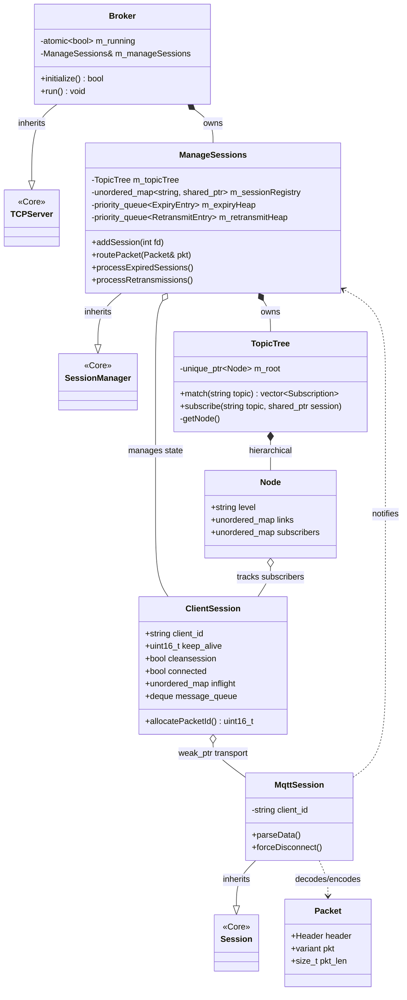

# Culex MQTT Broker

Culex is a MQTTv311 Broker implementation built on top of the Culex-Core asynchronous network engine. It features a **Reactor-Executor** architecture, supporting persistent sessions, QoS level 0/1/2 delivery guarantees, and a hierarchical topic matching engine.

## System Architecture

The broker extends the base TCP server logic into a protocol-aware messaging system. It separates the **Transport Layer** (active socket handling) from the **Session Layer** (persistent client state).



### Key Architectural Components

*   **Broker**: The primary orchestrator. It extends `TCPServer` to include an MQTT-specific event loop that handles Keep-Alive timeouts and QoS retransmissions.
*   **ManageSessions**: A specialized session manager that maintains a global registry of `ClientSession` objects. It manages the **Topic Tree** and handles the logic for session resumption.
*   **MqttSession**: The active network transport. It inherits from culex core - `Session` and uses a jump-table based `PacketHandler` to process MQTT control packets asynchronously.
*   **ClientSession**: The persistence container. It stores subscriptions, in-flight QoS packets, and queued messages for offline clients, allowing for seamless session resumption.
*   **TopicTree**: A thread-safe, hierarchical trie structure supporting MQTT wildcards (`+` and `#`) for efficient message routing.

## Features

*   **Protocol Support**: MQTT v3.1.1 compliant control packet handling.
*   **QoS Levels**: Full implementation of QoS 0, QoS 1, and the 4-way QoS 2 handshake.
*   **Session Persistence**: Support for `CleanSession=false`, allowing clients to disconnect and reconnect without losing in-flight state or subscriptions.
*   **Keep-Alive Management**: Session activity monitoring and session expiry using an efficient min-heap structure.
*   **Wildcard Routing**: Advanced topic matching engine for complex subscription patterns.

## 🛠️ Technical Specifications

### Concurrency Model
Culex utilizes a **Thread-per-Task** model. Raw bytes are read from the socket in the main thread (Reactor) and dispatched to a worker pool (Executor) for:
1.  **Unpacking**: Deserializing raw bytes into `Packet` variants.
2.  **Logic Processing**: Executing specific handlers (Connect, Publish, Subscribe).
3.  **Routing**: Traversal of the `TopicTree` to identify target subscribers.

### Resource Management
*   **RAII**: All socket handles and memory buffers are managed via RAII to prevent leaks.
*   **Weak Pointers**: The system uses `std::weak_ptr` to link active transports to persistent client states, preventing circular dependencies and ensuring safe cleanup.

---

## Project Structure


| Component | Files | Description |
| :--- | :--- | :--- |
| **Broker Logic** | `broker.h/cpp` | Entry point and MQTT maintenance loop. |
| **Management** | `managesessions.h/cpp` | Session registry and timeout/retry logic. |
| **Session State**| `mqttsession.h/cpp` | Active transport and persistent client state. |
| **Protocol** | `packets.h/cpp`, `unpack.h/cpp` | Packet definitions and binary deserialization. |
| **Handlers** | `packethandlers.h/cpp` | MQTT command logic (Connect, Publish, etc.). |
| **Data Structures**| `topictree.h/cpp` | Hierarchical trie for topic matching. |

---

## 🛠️ Building and Running

### Prerequisites
*   **CMake**: Version 3.0.2 or higher.
*   **Compiler**: C++17 compatible (GCC 7+, Clang 5+).
*   **OS**: Linux (requires `sys/epoll.h` support).

### Build Configurations

| Configuration | Flag | Features |
| :--- | :--- | :--- |
| **Debug** (Default) | `-DCMAKE_BUILD_TYPE=Debug` | `-g -O0`, AddressSanitizer (ASan) enabled. |
| **Release** | `-DCMAKE_BUILD_TYPE=Release` | `-O3` optimization, Sanitizers disabled. |


> **Note on Memory Safety**: In Debug mode, the project uses `-fsanitize=address`. If a memory leak or buffer overflow is detected, the program will terminate with a detailed error report.

### Build Commands
Use the following standard CMake out-of-source build flow:

```bash
# 1. Create and enter build directory
mkdir build && cd build

# 2. Configure the project
cmake -DCMAKE_BUILD_TYPE=Debug ..

# 3. Build the broker binary
sudo make install
```